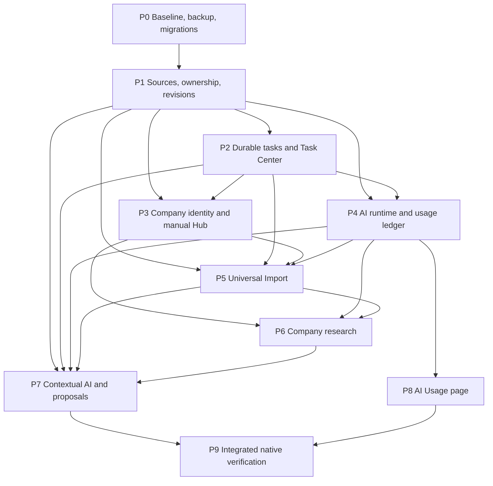

# Contextual workspace development plan

This is a plan for v0.2.0

This is the engineering handoff for the current [product requirements](../business/PRODUCT.md).
[Architecture](../tech/ARCHITECTURE.md) owns reusable contracts. [Data model](../tech/DATA_MODEL.md) owns current invariants and proposed migration order.
Phase labels group permanent [task IDs](TASK_REGISTRY.md). They do not allocate or replace IDs.
The original planning task changed documentation only. Implementation now follows this plan.
See the [implementation record](V0.2.0_IMPLEMENTATION.md) for delivered behavior, remaining requirements, and current task status.

## 1. Original audit baseline

Audit baseline: commit `c75ff7ae4cdaff7fbe88fc852e91886c328513d4`, reviewed on 2026-09-13 in America/Los_Angeles.
The existing working-tree change marked DEP-0002 done. That change remains intact.
The audit inspected all application source modules, manifests, task documents, root agent files, and test entry points.
No nested agent instructions or Cursor rules appeared in the repository inventory. CLAUDE.md points to AGENTS.md.

| Area | Verified implementation and reuse | Missing boundary or constraint |
| --- | --- | --- |
| Frontend | React 19, TypeScript 5.9, Vite 8, Lucide, CSS tokens. See package.json and frontend/main.tsx. | No router, state library, query cache, or chart library in dependencies |
| Shell/navigation | App.tsx uses Page state. Navigation contains Today, Vacancies, Applications, Documents, Profile, Settings. | Interviews and Glossary exist only in the Page union/captions. No corresponding navigation/workspace implementation |
| Jobs | VacancyForm, table filters, detail pane, shortlist/archive/restore, source link, original-description field | No extraction, salary, employment type, structured requirements/responsibilities/stack/benefits/dates |
| Documents | DocumentForm, DocumentDetail, immutable text versions, Blob text export | No rich editor, stable resume bullet model, PDF/DOCX/image parsing or export |
| Applications | One application per vacancy, stage history, document attachments, next action, due date | Multiple attempts are not supported. Company aggregation must respect existing uniqueness |
| Companies | Vacancy.company string and CompanyMark initial-letter fallback | No Company model/table, matching, company page, research, employment relation, or logo loader |
| Types | frontend/types.ts and backend/src/model.rs mirror DTOs manually | Rust validates strings. WorkMode has On-Site in TypeScript but On-site in SQL/forms/demo |
| State | App useState/useRef and act helper, localStorage preferences | One global busyRef blocks unrelated mutations. Every success reloads the complete Workspace |
| Persistence | Store, rusqlite, WAL, foreign keys, UUIDs, documents/<version-id>.txt | Schema creation only. No ordered upgrades, backup UI, entity revisions, or field provenance |
| Native boundary | Seven explicit commands in src-tauri/src/main.rs and a mutex-protected Store | No runner, task events, scoped acquisition, credential adapter, or network client |
| AI integrations | UI explicitly says AI analysis is not connected | No provider adapters or model calls |
| Usage/cost | No token or cost records | Needs central operation/attempt ledger before model features |
| Async/background | Promise-based UI calls, file.text(), status timer | No durable queue, retries, cancellation, checkpoints, or restart recovery |
| File acquisition | DocumentForm accepts .txt/.md up to 1,000,000 bytes, then calls file.text() | Original filename/type/hash are not persisted. TextDecoder validation is not strict |
| Paste/drop | Textarea paste uses ordinary browser editing | No shared paste controller, clipboard image intake, or explicit drag/drop handlers |
| URL import | Store normalizes HTTP(S), rejects credentials, removes fragments, checks exact URL uniqueness | open_source opens a system browser. It does not download or parse |
| Classification | Seven fixed document kinds in SQL, Rust validation, and UI | User selects kind. No automatic classification/confidence. Existing kind cannot change |
| User changes | save_vacancy replaces the complete row. Documents create versions. | No optimistic concurrency. A late automation or stale status form could overwrite fields |
| Notifications | App error banner, five-second role=status toast, local form errors, busy button states | No persistent task history, global progress, or OS notifications |
| Design components | Modal with focus/dirty guard, Field, Badge, Empty, CompanyMark, tokens.css, styles.css | No AI Operation control, source/proposal UI, Task Center, or global AI panel |
| Tests | Five Vitest rules, six Rust workflow tests, seven Playwright browser workflows, Windows native-smoke.mjs | No migration, task, provider, parser, or provenance fixtures |

Current evidence: `tsc.cmd --noEmit` reports TS2820 at frontend/api.ts:195 for On-site versus On-Site.
The historical successful build record is not proof that this checkout compiles.
The docs-only audit did not rebuild, run native workflows, or change application versions.

### Constraints discovered in code

1. Schema 1 has different document constraints across repository history. The old form allowed three kinds, and current schema.sql allows seven.
2. Store::open accepts every database marked version 1 without inspecting its document constraint. Editing schema.sql alone does not upgrade installed databases.
3. Store::workspace reads every version file. A missing file prevents the entire load, and large imports would increase memory and lock duration.
4. save_vacancy has no revision guard. App.updateStatus sends every vacancy field, even though only status changes.
5. Existing document kind is locked in both DocumentForm and Store::save_document. The new correction requirement needs an explicit metadata command.
6. File import replaces local editor content after an asynchronous read. It has no import-draft ownership model.
7. The existing 1 MB editor/byte rules and 200 KB vacancy description limit need explicit behavior for larger source assets.
8. config/protocol.json is empty. It is not an existing API contract or provider protocol.
9. CSP permits IPC connections, not frontend provider requests. New network work belongs in Rust.
10. There is no cross-process queue ownership. A Rust mutex protects only one application process.

## 2. Context Updated

The context hierarchy separates requirements, contracts, evidence, and execution:

| File | Responsibility after this update |
| --- | --- |
| AGENTS.md | Reading order and short invariants for ownership, contextual AI, tasks, and companies |
| README.md | Agent/developer entry points and accurate baseline/target distinction |
| docs/business/PRODUCT.md | Canonical product requirements for all seven requested areas |
| docs/tech/ARCHITECTURE.md | Current boundaries and planned runtime/import/ownership/company/usage contracts |
| docs/tech/DATA_MODEL.md | Current categories, compatibility warning, proposed records and ordered migrations |
| docs/design/UI.md | Quiet contextual AI, global task UX, Universal Add, Companies, AI Usage |
| docs/adr/001-025.md and docs/DECISIONS.md | Requirement acceptance and engineering choices, explicitly not implementation |
| docs/management/DEVELOPMENT_PLAN.md | This audit, phased delivery, dependencies, tests, risks |
| docs/management/TASKS.md and TASK_REGISTRY.md | Existing IDs retained and new phases reserved as 0011–0018 |
| docs/management/BACKLOG.md | Required work linked to this plan, separate from optional candidates |
| docs/tech/STACK.md and SECURITY.md | Resolved direction, remaining dependency choices, import/AI safeguards |
| docs/info/TERMINOLOGY.md | Shared definitions for Job/Vacancy, Company, AI Operation, override, and task |
| docs/business/MONETIZATION.md | AI Operation explicitly independent of price |
| docs/tech/VERIFICATION.md | Current audit evidence and historical-test boundaries |

CLAUDE.md remains unchanged because it already routes to AGENTS.md. CONCEPT.md remains historical.
This plan is the only detailed implementation roadmap. Context files link here instead of repeating phases.

## 3. Key Architecture Decisions

These engineering choices are the planning baseline. They do not claim user selection of providers or implementation:

1. Rust owns durable tasks. SQLite checkpoints survive restart, but execution requires a running process.
2. Source snapshots, field candidates, and explicit overrides coexist. Domain columns remain effective projections, protected by transactional revision checks.
3. Company is an independent domain entity before Universal Import links new vacancies. Existing application uniqueness remains unchanged.
4. All model calls pass through one operation service. Logical operations and provider attempts have separate accounting identities.
5. Import adapters produce persisted drafts. Review creates domain records, and optional company enrichment cannot block a saved vacancy.
6. The shell owns task subscriptions and AI context. Page components neither own worker lifetime nor call model providers.
7. Ordered migrations and recoverable backup precede new schema work. Both known schema-1 variants require fixtures.
8. New lists use paginated queries. Document content becomes lazy before binary imports arrive. Existing simple navigation and CSS tokens remain.

Detailed cancellation, retry, lease, source, matching, and accounting policies are in [architecture](../tech/ARCHITECTURE.md).
The event transport uses [Tauri events](https://v2.tauri.app/develop/calling-frontend/) for small change notices, backed by persisted snapshots.

## 4. Development Plan

Each phase must preserve the local manual workflow. New modules named here are proposed, not existing.
Dependencies express delivery gates. Independent work is possible only after shared contracts and task IDs are coordinated.

### P0 — Recoverable baseline and migrations

**Tasks:** IMP-0011, FT-0005.

**Goal and scope:** Establish a compilable baseline and safe upgrades before introducing domain tables.
Fix the WorkMode mismatch, add contract fixtures, and implement ordered migrations.
Add offline workspace backup/restore with integrity checks. Preserve the existing manual-copy recovery instructions.
The app-integrated backup UI waits for P2 and uses its queue. P0 supplies the recovery primitive needed before schema changes.

**Dependencies:** None. The repository audit in this document is complete. P0 implementation remains open.

**Implementation notes:** Reuse Store::open, URL validators, UUID file checks, and workflow fixtures.
Detect both historical three-kind and current seven-kind schema-1 databases.
Upgrade through a migration that preserves all IDs, attachments, events, and files.
Backup must include database and referenced assets. Restore into a separate directory and validate integrity.
Switch the restored workspace only while storage is closed.
Use a consistent SQLite snapshot or close/checkpoint the database before copying. Never copy only the live main database while WAL writes continue.
Frontend work covers recoverable startup status. Backend owns offline backup/migrations. No AI work.

**Files/modules affected:** backend/src/store.rs, schema.sql, model.rs, new migrations/ and backup.rs, frontend/types.ts, api.ts, App.tsx.
Tauri startup/commands and existing test files also change.

**Data/schema changes:** Migration 2 reconciles document constraints while retaining all seven existing kinds.
Migration metadata and backup manifests include schema version, file references, and hashes. No Company/AI tables yet.

**Errors and recovery:** Failed migration rolls back. Restore verifies counts, foreign keys, and file hashes.
Unsupported future schemas and corrupt backups produce actionable errors. Existing live data is never replaced by an unverified restore.

**Tests:** Both schema-1 fixtures → version 2, fresh setup, repeated open, newer version rejection, interrupted migration, backup round trip.
Include submitted version references and a database with WAL activity. Contract checks cover every WorkMode and document kind.

**Definition of Done:** TypeScript checks pass. Both schema-1 variants upgrade without data loss.
A restored workspace reproduces exact submitted content. Native startup and backup recovery have isolated Windows evidence.

**Risks:** Foreign-key dependencies during table replacement and incomplete live database copies.

### P1 — Source assets and protected data

**Task:** FT-0012.

**Goal and scope:** Establish ownership and revision contracts before adding automated writers.
Introduce original assets, source snapshots, candidates, overrides, and persisted change proposals.
Add structured vacancy fields and lazy document-body queries to support later imports.

**Dependencies:** P0.

**Implementation notes:** Reuse Store validation and immutable version writes.
Introduce changed-field commands with expected revisions. Status changes become narrow updates.
Protect legacy fields as user-owned. Explicit null/empty overrides remain distinguishable from absent overrides.
Use typed field keys rather than arbitrary client-provided SQL paths.
Document suggestions reference base version and text-range fingerprints. Acceptance creates a new immutable version.
The existing textarea remains usable. A rich editor is not a prerequisite for text-range proposals.
Frontend owns conflict/source review and unsaved drafts. Backend commits projections and ownership atomically. AI produces no results yet.

**Files/modules affected:** backend/src/model.rs, store.rs, new sources.rs/provenance.rs, migrations/.
frontend/types.ts, api.ts, forms.tsx, App.tsx, new proposal/source components, Tauri commands.

**Data/schema changes:** Migration 3 adds sources, source_snapshots, entity_sources, field_candidates, field_overrides, change_proposals, and entity revisions.
Vacancy gains nullable salary amount/range/currency/period, employment type, source dates, and structured requirement/responsibility/stack/benefit values.
Large original text remains in assets. Effective vacancy description retains an explicit display/edit limit.
Document metadata gains revision and correctable category support. Categories expand additively.
Original assets use managed UUID/hash names. Legacy text versions remain byte-identical.

**Errors and recovery:** Source writes use temporary files, flush, hash verification, and commit records.
Crash leftovers are quarantined/reconciled, not treated as committed inputs.
Stale proposals remain reviewable with conflict details. Invalid candidate types cannot reach effective columns.
Oversized source content remains available as an asset, with an explicit extraction/display limit.

**Tests:** Manual override → refresh, explicit empty override, unchanged fields, two concurrent edits, stale accept, undo/clear override.
Check source reprocessing, crash between file/DB commit, missing files, category correction, and submitted version preservation.

**Definition of Done:** No automated/candidate path can overwrite an override.
Late results cannot replace newer edits. A new version does not alter submitted attachments.
List loading does not read every document body, and source files support deterministic reprocessing.

**Risks:** Overgeneralized field storage, projection drift, and accidental creation of overrides for unchanged form fields.

### P2 — Persistent task runtime and Task Center

**Tasks:** FT-0013 and the app-integrated backup UI from FT-0005.

**Goal and scope:** Run long operations independently of pages and support concurrent batches.
Deliver queue, attempts, dependencies, cancellation, retries, recovery, and global task UI before real imports.

**Dependencies:** P1 for source references and guarded commits.

**Implementation notes:** Add a Rust runner plus short enqueue/list/cancel/retry commands.
Reuse Store for short transactions. Never retain its lock over network, model, or extraction work.
Use the runner lease, claim generations, concurrency budgets, and retry policy defined in architecture.
Persist the dependency graph before execution. Required failures stop dependent work. Optional failures leave core results accessible.
Extract only the shell state needed for Task Center. Ordinary form saves keep local pending indicators.
Use deterministic fake stages first. No real model calls in this phase.
Connect the P0 backup primitive through the queue. Restoration requires exclusive storage access and runner suspension.

**Files/modules affected:** new backend/src/tasks/, backend/src/lib.rs, store.rs, model.rs, migrations/.
src-tauri/src/main.rs and new event/runner wiring. frontend/App.tsx, api.ts, types.ts, new shell/ and tasks/, styles.css.

**Data/schema changes:** Migration 4 adds background_tasks, task_attempts, task_dependencies, task_checkpoints, and runner lease records.
Payloads contain source/entity IDs and schema versions, not credentials or duplicated documents.

**Errors and recovery:** On restart, reclaim only expired claims and resume safe stages.
Cancellation wins at the result commit boundary. A completed commit remains saved.
Events can be lost or duplicated. Revision-aware snapshots restore UI state after reconnect.
Unknown external outcomes stay waiting. Unsupported task payload versions fail explicitly after upgrades.

**Tests:** Five independent fake imports, page switches, cancellation before/during commit, retry exhaustion, optional-child failure, DAG cycle rejection.
Kill/restart between checkpoints. Exercise two app instances, lease expiry, stale worker results, and lost events.

**Definition of Done:** Five admitted tasks run within concurrency limits and remain visible across navigation.
Restart resumes safe work once. Repeated cancel/retry cannot duplicate saved outputs.
The Task Center shows stage, progress, elapsed time, details, and actionable errors without blocking unrelated forms.

**Risks:** Locks around slow work, lease races, event storms, or falsely reporting cancelled work as cost-free.

### P3 — Company identity and manual Company Hub

**Task:** FT-0014.

**Goal and scope:** Create Company as a reusable entity before imported jobs need matching.
Deliver manual creation/editing, related vacancies/applications, employment relationships, cards, details, merge, and split correction.

**Dependencies:** P1 for ownership. P2 supplies long migration/reconciliation progress after the schema upgrade.

**Implementation notes:** Reuse Vacancy.company for the migration snapshot and CompanyMark for missing logos.
Backfill one provisional Company per exact trimmed legacy label. Preserve original labels.
Do not merge fuzzy or case-only matches automatically. Store evidence/confidence and require review for ambiguity.
Vacancy save accepts company ID plus display snapshot. Existing application methods retain vacancy IDs.
Derive application summaries per company instead of adding one company stage.
Contacts can start as company-scoped information. A global Contacts destination is not required.
AI work is deferred to P6.

**Files/modules affected:** new backend/src/companies/, migrations/, model.rs, store.rs.
frontend/App.tsx navigation, forms.tsx, types.ts, api.ts, new companies/, CompanyMark and shared tokens.

**Data/schema changes:** Migration 5 adds companies, company_aliases/domains, employment_relationships, and nullable vacancies.company_id.
The migration retains applications.vacancy_id uniqueness and all historical company strings.
Company profile facts use P1 provenance. Relational identity and employment dates remain typed fields.

**Errors and recovery:** Ambiguous employers remain provisional/unlinked until review.
Merge is transactional and preserves aliases, sources, links, and history. Conflicting overrides require user selection.
Split allows correction of namesakes grouped during legacy migration.
A failed backfill batch resumes without duplicate companies.

**Tests:** Multiple jobs with different stages at one company, namesakes, case variants, empty legacy anomalies, domain mismatch.
Check past/current employment without a vacancy, merge/split, restart, notes preservation, and exact application links.

**Definition of Done:** Companies is a functioning manual section.
Related jobs retain distinct stages. Past/current employers are visibly marked.
Backfilled records preserve IDs and manual facts. Company Hub works offline with no provider configured.

**Risks:** Same-name employers, employer versus recruiter identity, and misleading aggregate statuses.

### P4 — Central AI Operation runtime and ledger

**Task:** FT-0007, expanded without changing its permanent ID.

**Goal and scope:** Make every model call identifiable, authorized, cancellable through tasks, and centrally accounted.
Deliver provider capability discovery, one operation API, attempt ledger, model settings, and the shared AI Operation control.

**Dependencies:** P1 and P2. Company links become available from P3 but are optional for generic operations.

**Implementation notes:** Add provider, transport, credential, and pricing interfaces in Rust.
Start with a deterministic fake adapter. Select the first real adapter in a bounded implementation spike.
No product research needs repetition. Selection concerns runtime capabilities, local packaging, credentials, and usage metadata.
An unavailable account cannot be presented as verified remote execution.
Record logical operation and attempt IDs before dispatch. Save typed output and source references before proposal creation.
No feature directly calls a provider. Include classification and model-based OCR.
The shared marker exposes action purpose, model/provider, unknown estimates, and permission scope before invocation.

**Files/modules affected:** new backend/src/ai/, tasks/ integration, migrations/, Tauri credential/settings commands.
frontend/ai/, api.ts, types.ts, Settings in App.tsx, shared components and tests.

**Data/schema changes:** Migration 6 adds ai_operations, ai_attempts, usage measurements, price snapshots, and non-secret provider settings.
Fields include operation type, parent task/entity, model/provider, request ID, status, latency, tokens, cost/currency, error, and usage quality.
Secrets live in OS storage through references. Unknown usage remains nullable.

**Errors and recovery:** Separate transport failure, authorization failure, invalid model output, provider refusal, and unknown remote outcome.
Retries create distinct attempts. Duplicate usage callbacks reconcile one attempt.
Cancelled responses cannot apply proposals, but their usage remains recorded.
A crash after dispatch requires reconciliation or a visible unknown result, not automatic duplicate billing.

**Tests:** Fake provider success, malformed output, refusal, rate limits, retry, duplicate callbacks, unknown tokens, free/local cost, cancelled billable calls.
Check authorization scope, credential redaction, prompt-injection fixtures, and no feature bypass of the operation entry point.
Use consented fictional inputs for any real-provider smoke check.

**Definition of Done:** Every model call has a logical operation and attempt history.
Counts distinguish user operations from retries. Estimated and actual cost remain separate.
Unknown cost is visible. Manual workflows remain available without credentials.

**Risks:** Provider metadata differences, ambiguous billing outcomes, streaming partial results, and accidental personal-data transmission.

### P5 — Universal Import across input types

**Tasks:** FT-0015 and FT-0006. FT-0006 retains PDF/DOCX export scope.

**Goal and scope:** Deliver one input surface with persistent review and reusable adapters.
Jobs support URL, text/paste, screenshot/image, PDF, DOCX, and drag-and-drop.
Documents support PDF, DOCX, text/Markdown, image, paste, and drag-and-drop without a required initial category.

**Dependencies:** P1 sources/proposals, P2 tasks, P3 company linking, P4 optional model-backed stages.

**Implementation notes:** First deliver text/paste/file acquisition, drafts, deterministic parsing, review, and idempotent save.
Then add URL extraction, PDF/DOCX, image/OCR, and native drop/clipboard paths through the same contracts.
Each source independently follows acquisition, extraction, classification, parsing, normalization, optional enrichment, review, and save.
Use extraction adapters with tool/version metadata and bounded resource budgets.
Classification returns confidence and method. Low-confidence results stay Unknown and require correction.
Users can change the proposed entity type. Company matching appears in review.
Preserve original salary text alongside normalized amount/currency/period. Do not infer missing currency or dates as facts.
Document category corrections use P1 metadata commands. The original binary remains separate from extracted text.
PDF/DOCX export derives from an explicitly selected immutable version and needs rendered-output review.
Export does not silently claim preservation of an imported file's original layout.

**Files/modules affected:** new backend/src/import/, sources.rs, companies/, tasks/, ai/, migrations/.
Tauri scoped acquisition/drop/clipboard wiring and capabilities. frontend/import/, shell/UniversalAdd, forms.tsx, api.ts, types.ts.
Parser dependencies belong in Cargo manifests/lockfile or explicitly packaged extraction helpers.

**Data/schema changes:** Migration 7 adds import_sessions, import_items, stage_runs, classification results, review revisions, and target links.
Existing structured vacancy fields and source tables are reused.
Import saves have idempotency keys. A Job Description document and a created Vacancy can share source links without duplicating bytes.

**Errors and recovery:** Unsupported/encrypted/corrupt files, decompression bombs, huge images, redirects, unavailable pages, and OCR uncertainty produce per-item errors.
Restricted pages offer paste/upload. A failed source does not fail the other four imports.
Sources and drafts survive restart. Reprocess produces candidates, never silent field changes.
Cancelled drafts remain visible for explicit retry/discard. Discard cannot remove assets referenced by saved records or proposals.

**Tests:** Golden fixtures for every acquisition path and media type, exact source hashes, manual reclassification, duplicate URLs, multilingual text, uncertain salary.
Include malformed PDF/DOCX, encrypted files, large images, native drop, clipboard image, source limits, and restart during review.
Test five mixed imports with one failure and one cancellation.
Render PDF/DOCX exports and compare selected content/version. Verify originals and submitted references remain unchanged.

**Definition of Done:** The input matrix works through one pipeline, with explicit unsupported/error states.
At least five mixed items process independently. Review resumes after restart and can correct category/entity/company.
Save fills supported structured fields and preserves unknowns. Reprocessing cannot overwrite user overrides.
Native Windows evidence covers file/drop/paste behavior. Browser fixtures alone do not establish native support.

**Risks:** Parser licenses/packaging, OCR quality, large-source memory, unsafe URL redirects, and inaccessible job sites.

### P6 — Company research and enrichment

**Task:** FT-0016.

**Goal and scope:** Add optional, source-backed company facts, research, refresh, and logos without delaying vacancy save.

**Dependencies:** P3, P4, and P5 acquisition/extraction adapters.

**Implementation notes:** Reuse Company matching, P1 proposals, P2 optional subtasks, and P4 accounting.
Gather authorized sources through a research adapter. Model summaries link to retrieved evidence.
Research covers description, industry, website, headquarters, remote policy, founding date, employee count, stack, contacts, social links, and leadership.
Images and logos use a managed asset cache. CompanyMark remains the fallback.
Use the initial 30-day stale indicator from architecture and explicit refresh.
An existing successful result stays visible during refresh. Store the last attempt separately from the last successful update.

**Files/modules affected:** backend/src/companies/research.rs and assets.rs, import acquisition adapters, ai/, tasks/, migrations/.
frontend/companies/ details, source popovers, refresh controls, shared AI Operation control.

**Data/schema changes:** Migration 8 adds research_runs and company_assets with source/hash metadata.
Existing candidates and company fields store researched values. Contacts start company-scoped, without a separate global navigation system.

**Errors and recovery:** Optional research/logo failure preserves the saved Company/Vacancy and previous facts.
Domain/name disagreement produces a review candidate. Late refresh cannot overwrite a newer edit.
Invalid or oversized images use fallback. Broken sources remain marked with their observation dates.

**Tests:** Research provider unavailable, conflicting sources, stale refresh, manual override during refresh, logo failure, domain collision.
Check distinct application stages, current employment badge, optional-child errors, and centralized usage.

**Definition of Done:** Company details show sources and update times with explicit refresh.
Research never blocks manual use or vacancy save. Every generated fact is reviewable and linked to evidence.

**Risks:** Incorrect identity, outdated employment counts/policies, unsupported claims, and unnecessary research calls.

### P7 — Contextual AI throughout the workspace

**Task:** FT-0008, expanded to the contextual proposal workflow.

**Goal and scope:** Deliver a global AI sidebar, bottom placement, inline suggestions, field comments, contextual actions, and reviewable document changes.

**Dependencies:** P1 proposal ownership, P2 tasks, P4 runtime. P5/P6 provide import/company contexts.

**Implementation notes:** Add a typed AI context registry at shell lifetime.
Context includes entity/base revision, document version, field, and selected text. Navigation never retargets existing tasks.
Right and bottom placement are user preferences. Narrow layout keeps the main workspace usable.
Keep entity details separate from AI. Reuse Modal, Field, Badge, Empty, tokens, and focus rules.
Add job analysis, resume tailoring, bullet/experience improvement, cover letter generation, classification explanations, and company insights as operation types.
Use the current text editor with selections and version fingerprints. A rich editor can later supply stable block IDs.
AI comments reference fields or document versions. Dismissal and proposal status persist, preventing repeated unsolicited hints.

**Files/modules affected:** frontend/shell/, ai/, App.tsx, forms.tsx, components.tsx, styles.css, tokens.css.
backend/ai context builders, provenance.rs, model.rs, Tauri commands and browser demo contracts.

**Data/schema changes:** Migration 9 adds context preferences and annotation/dismissal records if existing proposal metadata cannot represent them.
Document generation creates new DocumentVersion records. No changes to submitted attachments.

**Errors and recovery:** Stale selection/revision requires a fresh review. Rejected suggestions stay dismissed.
Provider absence offers settings/manual work. Context changes do not erase pending operation results.
No automatic model call occurs merely because a page or panel opens.

**Tests:** Keyboard focus, Escape, panel hide/restore, right/bottom placement, minimum 620-pixel native width, browser narrow layouts, reduced motion.
Check context switches during tasks, stale bullet proposals, field comments, dismissals across restart, and source explanations.
A generated cover letter cannot introduce unsupported career claims as accepted facts.

**Definition of Done:** All model actions use one marker and central runtime.
The AI panel follows context while tasks retain their original targets.
Suggestions remain quiet, dismissible, and explicitly applied. Accepted edits create guarded field changes or new document versions.

**Risks:** UI overload, stale context, accidental model calls on render, and collisions between two right-side panels.

### P8 — AI Usage page

**Task:** UI-0017.

**Goal and scope:** Make usage and cost understandable through one ledger-backed page.
Deliver summary cards, tables, accessible charts, filters, and paginated operation/attempt history.

**Dependencies:** P4. P5–P7 provide realistic categories and entity links but are not required for initial queries.

**Implementation notes:** Aggregate in Rust/SQLite. Use fixtures before real operations are available.
Show logical operation count separately from attempts. Group by time, feature, provider/model, and optional vacancy/company.
Use local-calendar date ranges with UTC boundaries. Keep currencies separate.
Show cost coverage, unknown usage, and estimated versus actual amounts explicitly.
Charts share filters with tables and have text/table alternatives. No model call powers this analytics page.

**Files/modules affected:** backend/src/ai/usage.rs, Store query methods, Tauri commands.
frontend/ai/usage/, navigation in App.tsx, api.ts, types.ts, shared tokens.

**Data/schema changes:** Migration 10 adds necessary time/provider/feature/entity indexes after query-plan measurement.
No independent feature counters or duplicate billing tables.

**Errors and recovery:** Failed queries retain filters and support retry. Empty history is distinct from an unavailable ledger.
Historical price snapshots remain stable when current prices change. Late usage reconciliation updates aggregates without double counting.

**Tests:** Retry versus operation counts, cancelled billable attempts, duplicate callbacks, unknown usage, multiple currencies, model changes.
Check local date boundaries, pagination consistency, empty history, chart/table parity, and large synthetic ledgers.

**Definition of Done:** Summary totals reconcile to filtered attempt history.
All requested breakdowns work where metadata exists. Unknown cost cannot appear as zero.
The page remains responsive with a paginated synthetic ledger and passes keyboard/table access checks.

**Risks:** Incorrect denominators, mixed currencies, misleading estimates, and slow aggregation.

### P9 — Integrated recovery and release checks

**Tasks:** IMP-0018, with UI-0004 and DEP-0001/DEP-0003 for their existing scopes.

**Goal and scope:** Verify the complete workflow and upgrade path before claiming the new product slice is ready.

**Dependencies:** P0–P8.

**Implementation notes:** Reuse current Vitest, Rust, browser Playwright, and Windows native-smoke infrastructure.
Add a cross-system fixture: five jobs, mixed documents, manual corrections, company refresh, AI proposals, usage, cancellation, and restart.
Measure import latency, memory, queue responsiveness, and large-workspace query performance with recorded hardware and fixtures.
Review permissions, source retention, backup coverage, secrets, accessibility, and visible error recovery.
No new product subsystem is added in this phase.

**Files/modules affected:** backend/tests/, frontend tests, tests/workspace.spec.ts, scripts/native-smoke.mjs, CI, verification documentation.
Manifests change only for required test/build dependencies or synchronized build versions.

**Data/schema changes:** No planned domain migration. Backup manifests must include sources, research assets, queue, and ledger.
Any corrective migration needs fixtures and an incremented version. Never edit an already-shipped migration in place.

**Errors and recovery:** Test process termination after dispatch, file write, stage checkpoint, result commit, and review acceptance.
Restore a backup and validate that sources, exact submitted bytes, company links, and operation totals remain intact.
Recovery must not silently restart unknown-cost provider attempts.

**Tests:** npm.cmd run check, npm.cmd run test:e2e, Clippy, formatting, debug native build, npm.cmd run test:native.
Run required Windows release/package checks and separate macOS build/native checks on an available host.
Preserve DEP-0002's user completion mark. Record any new installer evidence separately.

**Definition of Done:** Migration and workflow gates pass with recorded fixture versions.
Windows native evidence proves navigation-independent tasks, restart recovery, and source/version preservation.
macOS claims require macOS evidence. Remaining platform gaps are explicit release constraints.
All successful builds follow AGENTS.md version synchronization rules.

**Risks:** Browser/native divergence, untested parser packaging, platform credential differences, and inflated release claims.

## 5. Dependency Graph

P5 deterministic adapters can proceed before a real provider is available.
P8 can start once the P4 ledger contract is stable. Full delivery still requires P9.
Task scheduling, field ownership, and usage accounting are separate contracts even when one operation uses all three.

## 6. Risks / Open Questions

| Issue | Decision or bounded next action |
| --- | --- |
| Current TypeScript failure | P0 fixes the known string mismatch before implementation validation |
| Two schema-1 variants | P0 inspects actual schema shape and tests both upgrade fixtures |
| Resume bullets lack stable IDs | P1/P7 use exact base version plus text range fingerprint. Rich editor selection stays optional |
| Original bytes versus editable text | Preserve both. Binary original and extracted text have different source/version identities |
| Provider/OCR/parser choice | P4/P5 run bounded capability and packaging spikes with explicit fixtures. No provider/account is selected here |
| Remote data permission | Persist scoped authorization before dispatch. Importing a local file alone does not authorize uploading it |
| Retry after unknown model outcome | Wait for reconciliation or explicit retry. Exactly-once external billing cannot be promised |
| Same-name companies | Provisional legacy groups plus merge/split review. Domains need evidence and cannot come from job-board URLs |
| Window close/restart | Tasks stop with the process and recover later. OS background execution is a separate product change |
| Full workspace loading | P1 introduces lazy bodies. Later lists/ledger use pagination and scoped invalidation |
| Mutable document category | Add a separate metadata correction command. Preserve existing version bytes and submission links |
| Source/usage retention | Default retains referenced evidence and usage metadata. P9 defines explicit cleanup for discarded, unreferenced drafts/assets |
| Multiple applications per vacancy | Keep current unique relation. Do not expand it as a side effect of Company Hub |
| Cross-device synchronization | Keep PL-0009 separate. Local revision guards do not claim a synchronization conflict protocol |
| Historical native results | Re-run relevant checks after implementation. Existing logs are not evidence for planned systems |

No open question blocks documentation handoff.
Provider credentials and a macOS host can block specific live acceptance checks, not core implementation or fake-adapter coverage.

## 7. Recommended Implementation Order

1. IMP-0011 + FT-0005: Restore a reliable baseline, migration fixtures, and recoverable backups.
2. FT-0012: Add sources, protected fields, revisions, document metadata correction, and lazy bodies.
3. FT-0013: Implement persistent tasks and the global Task Center with fake stages.
4. FT-0014: Deliver Company identity, safe backfill, manual Hub, and employment relationships.
5. FT-0007: Add the central AI runtime, operation marker, authorization, and attempt ledger.
6. FT-0015 + FT-0006: Deliver Universal Import, review, format adapters, and version-specific PDF/DOCX export.
7. FT-0016: Add optional company research, refresh, and managed logos.
8. FT-0008: Add contextual AI panel, inline comments, and guarded document/field proposals.
9. UI-0017: Deliver the ledger-backed AI Usage page.
10. IMP-0018: Run integrated migration, recovery, accessibility, and native release gates.
